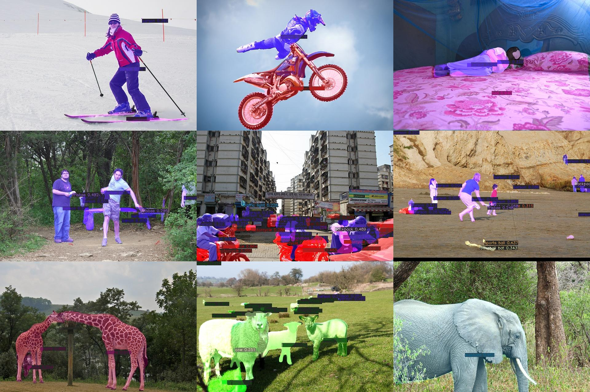

<h1 align="center">

🚀SparseInst🚀 NCNN Deployment

</h1>

# Introduction

This repo is based on [SparseInst](https://github.com/hustvl/SparseInst). SparseInst is a fast and high precise instance segmemation alogrithm.

# Preview

<div align="center">

 

</div>


# Usage

## Compile NCNN
You can reference [ncnn_docs](https://github.com/Tencent/ncnn/wiki/how-to-build). There is for linux backend.

1. clone repo
```shell
git clone https://github.com/Tencent/ncnn.git
cd ncnn
git submodule update --init
```
2. install dependencies
```shell
sudo apt install build-essential git cmake libprotobuf-dev protobuf-compiler libvulkan-dev vulkan-utils libopencv-dev
```

3. build
```shell
mkdir -p build && cd build
cmake -DNCNN_VULKAN=ON -DNCNN_BUILD_EXAMPLES=ON -DNCNN_PYTHON=ON -DNCNN_BUILD_TESTS=ON ..
make -j$(proc)
make install
```

## Compile Repo

```shell
git clone https://github.com/DDGRCF/sparseinst_ncnn_demo.git
cd sparseinst_ncnn_demo
mkdir -p build && cd build
cmake .. -DNCNN_DIR=/path/to/ncnn/build/install/lib/cmake/ncnn (option)[-DNCNN_PROFILING=ON]
make -j$(nproc)
# Open NCNN_PROFILING option will output time cost and detect image information.
```


## Download Model

This repo provide [sparseinst_r50_giam_soft.yaml](https://github.com/hustvl/SparseInst/blob/main/configs/sparse_inst_r50_giam_soft.yaml) and [sparseinst_inst_cspdarknet53_giam.yaml](https://github.com/hustvl/SparseInst/blob/main/configs/sparse_inst_cspdarknet53_giam.yaml) ncnn converted model. For Resnet50, you can download by following commands:
```shell
latest_version=v1.0.0
wget https://github.com/DDGRCF/sparseinst_ncnn_demo/releases/download/${latest_version}/sparseinst-resnet-sim-opt.param
wget https://github.com/DDGRCF/sparseinst_ncnn_demo/releases/download/${latest_version}/sparseinst-resnet-sim-opt.bin
```

## Run Repo
```shell
param_path=/path/to/your/param
bin_path=/path/to/your/bin
image_path=/path/to/your/image
save_path=/path/to/your/save_image
./sparseinst_ncnn_demo ${param_path} ${bin_path} ${image_path} ${save_path}
# NOTE: image_path can be dir or file.
```

# About Performance
I compare the ncnn model with other frame (onnxruntime, mnn), results as following:

| **backend** | **inference time** | **remark** |
|:-----------:|:------------------:|:------------------:|
| ncnn        | 0.5501 s          | not starting vulkan         |
| mnn        | 0.5492 s          | none        |
| onnxruntime | 0.9103 s          | not using gpu version          |

**Device**: `CPU: 20 12th Gen Intel(R) Core(TM) i7-12700H`. 

**Extra**: Test run 100 times(avg) and did't include data preprocess and data postprocess. For convenience, both of them used python api.

# License
This repo is under [MIT LICENSE](./LICENSE)

# Thanks

* [ncnn](https://github.com/Tencent/ncnn)
* [sparseinst](https://github.com/hustvl/SparseInst)
